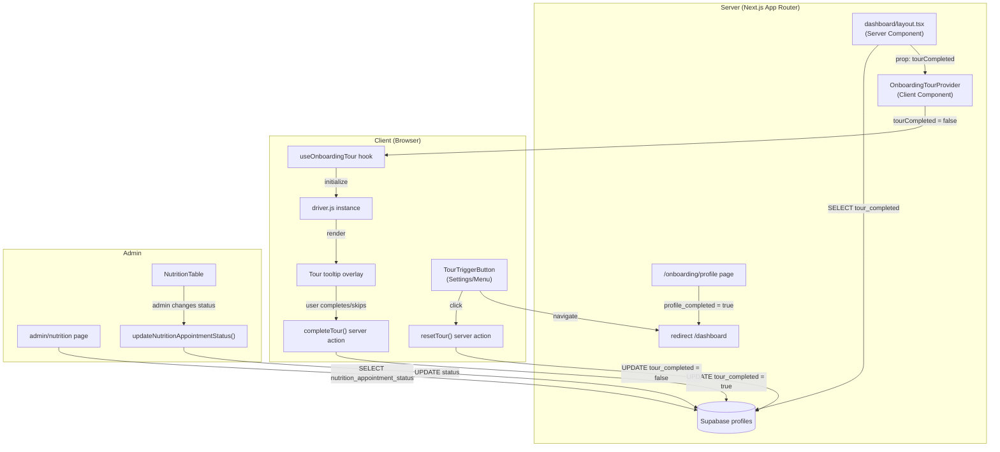

# Onboarding Tour -- Technical Architecture Design

## 1. Executive Summary

This document defines the architecture for a guided tooltip-based onboarding tour that appears to trainees on their first visit to the dashboard after completing profile onboarding. The tour highlights key features (forms, nutrition questionnaire, streaks), persists completion state in the database, and provides an admin-facing indicator for nutrition appointment scheduling status.

---

## 2. Library Recommendation: driver.js

### Candidates Evaluated

| Library | RTL Support | Mobile | React 19 | Bundle Size | Active Maint. |
|---------|------------|--------|----------|-------------|---------------|
| react-joyride | Partial (CSS overrides needed) | Good | Wrapper needed (class-based core) | ~45 kB gzip | Moderate |
| driver.js | Native (`direction: "rtl"` config) | Excellent (responsive positioning) | Framework-agnostic (works natively) | ~5 kB gzip | Active |
| shepherd.js | Manual CSS | Good | Needs wrapper | ~25 kB gzip | Active |
| intro.js | Partial | Moderate | Needs wrapper | ~15 kB gzip | Declining |

### Decision: driver.js

**Rationale:**

1. **Native RTL support** -- Built-in `direction: "rtl"` configuration option eliminates custom CSS overrides. This is the single most important differentiator for a Hebrew app.
2. **Tiny bundle** -- ~5 kB gzipped vs ~45 kB for react-joyride. This app is mobile-first; every kilobyte matters.
3. **Framework-agnostic** -- No React wrapper dependency means no compatibility risk with React 19 or future React versions. The API is imperative (`driver.highlight()`, `driver.drive()`), which integrates cleanly from a `useEffect` or event handler.
4. **Mobile-responsive** -- Automatically repositions tooltips based on viewport, handles scroll-into-view, and supports touch events.
5. **Customizable styling** -- Supports custom CSS classes for tooltip/overlay, allowing us to match the existing Tailwind/shadcn design system.
6. **No portals or context complexity** -- Unlike react-joyride which injects a React tree, driver.js operates on raw DOM, avoiding conflicts with Next.js server/client boundaries.

**Trade-off acknowledged:** driver.js is not a React component library, so we must build a thin React hook/wrapper. This is a small cost relative to the RTL and bundle size advantages.

---

## 3. Data Model

### 3.1 Schema Change: `profiles` Table -- Add `tour_completed`

Add a single boolean column to the existing `profiles` table.

```sql
ALTER TABLE public.profiles
  ADD COLUMN tour_completed BOOLEAN NOT NULL DEFAULT false;
```

**Why on `profiles` and not a separate table:**
- The `profiles` table already holds `profile_completed` (the prerequisite for the tour).
- Adding one boolean avoids a join for the most common query (dashboard layout checks).
- The `profiles` table is read on every dashboard page load (see `layout.tsx` line 22); adding one column to the existing SELECT is zero additional cost.

**Why a DB column and not `localStorage`:**
- The tour must be consistent across devices and browsers.
- Admin queries ("who hasn't completed the tour?") require server-side data.
- `localStorage` is already used for dismiss-state on the `NutritionMeetingBanner` -- we should not repeat that pattern for durable user state.

### 3.2 Schema Change: `profiles` Table -- Add `nutrition_appointment_status`

```sql
CREATE TYPE public.nutrition_appointment_status AS ENUM (
  'not_scheduled',
  'scheduled',
  'completed'
);

ALTER TABLE public.profiles
  ADD COLUMN nutrition_appointment_status public.nutrition_appointment_status
    NOT NULL DEFAULT 'not_scheduled';
```

**Why an enum with three states instead of a boolean:**
- The nutritionist needs to distinguish between "trainee hasn't scheduled yet" (needs follow-up), "trainee has a future appointment" (no action needed), and "appointment done" (follow-up on meal plan).
- A boolean (`nutrition_appointment_scheduled`) would collapse scheduled and completed into one state, losing visibility into the appointment pipeline.

**Why on `profiles` and not a separate table:**
- This is a single status indicator per trainee, not a log of appointments.
- If full appointment scheduling is needed later (dates, notes, history), a `nutrition_appointments` table can be added and this column can serve as the denormalized current-status for quick admin queries.

### 3.3 TypeScript Type Updates

Update `src/types/database.ts` to include the new fields:

```typescript
// In profiles Row/Insert/Update:
tour_completed: boolean;
nutrition_appointment_status: 'not_scheduled' | 'scheduled' | 'completed';
```

Add a helper type:

```typescript
export type NutritionAppointmentStatus = 'not_scheduled' | 'scheduled' | 'completed';
```

### 3.4 Migration File

File: `supabase/migrations/20260225XXXXXX_onboarding_tour_and_nutrition_status.sql`

```sql
-- Add tour_completed flag to profiles
ALTER TABLE public.profiles
  ADD COLUMN IF NOT EXISTS tour_completed BOOLEAN NOT NULL DEFAULT false;

-- Add nutrition appointment status enum and column
DO $$ BEGIN
  CREATE TYPE public.nutrition_appointment_status AS ENUM (
    'not_scheduled', 'scheduled', 'completed'
  );
EXCEPTION
  WHEN duplicate_object THEN NULL;
END $$;

ALTER TABLE public.profiles
  ADD COLUMN IF NOT EXISTS nutrition_appointment_status public.nutrition_appointment_status
    NOT NULL DEFAULT 'not_scheduled';

-- Index for admin queries: "show me trainees who haven't completed nutrition appointment"
CREATE INDEX IF NOT EXISTS idx_profiles_nutrition_appointment_status
  ON public.profiles (nutrition_appointment_status)
  WHERE role = 'trainee' AND deleted_at IS NULL;

-- RLS: profiles table already has policies allowing users to read/update their own row.
-- The existing UPDATE policy on profiles already permits self-updates,
-- so the trainee can mark tour_completed = true via their own RLS context.
-- Admin can update nutrition_appointment_status via the existing admin UPDATE policy.
-- No new RLS policies needed.
```

### 3.5 RLS Analysis

The existing `profiles` RLS policies:
- **SELECT**: Users can read their own profile. Admins/trainers can read all.
- **UPDATE**: Users can update their own profile. Admins can update any profile.

These existing policies are sufficient:
- Trainee marks `tour_completed = true` on their own row -- covered by self-update policy.
- Admin updates `nutrition_appointment_status` on any trainee row -- covered by admin update policy.
- No new INSERT or DELETE policies needed.

---

## 4. Component Architecture

### 4.1 Component Tree

```
src/app/dashboard/layout.tsx (Server Component)
  |-- reads profile.tour_completed from DB
  |-- passes tourCompleted prop to client wrapper
  |
  +-- DashboardNav (existing, client)
  +-- <main>{children}</main>
  +-- DashboardBottomNav (existing, client)
  +-- OnboardingTourProvider (NEW, client)
       |-- conditionally renders tour based on:
       |     route === "/dashboard" (only on home page)
       |     tourCompleted === false
       |-- uses useOnboardingTour hook
       |-- calls completeTour server action on finish/skip

src/features/onboarding-tour/
  +-- index.ts                          (barrel export)
  +-- components/
  |   +-- OnboardingTourProvider.tsx     (client component, orchestrates driver.js)
  |   +-- TourTriggerButton.tsx         (client component, for re-triggering from settings)
  +-- hooks/
  |   +-- useOnboardingTour.ts          (encapsulates driver.js lifecycle)
  +-- lib/
  |   +-- actions/
  |   |   +-- complete-tour.ts          (server action: mark tour_completed = true)
  |   |   +-- reset-tour.ts            (server action: mark tour_completed = false)
  |   |   +-- update-nutrition-status.ts (server action: admin updates appointment status)
  |   +-- config/
  |   |   +-- tour-steps.ts            (step definitions with Hebrew text)
  |   +-- styles/
  |       +-- tour.css                  (driver.js custom theme overrides)
  +-- types/
      +-- index.ts                      (TourStep, TourConfig types)
```

### 4.2 Component Responsibilities

#### `OnboardingTourProvider` (Client Component)

**Location:** `src/features/onboarding-tour/components/OnboardingTourProvider.tsx`

**Responsibility:** Orchestrates the tour lifecycle on the dashboard page.

**Props:**
```typescript
interface OnboardingTourProviderProps {
  tourCompleted: boolean;
  userId: string;
}
```

**Behavior:**
1. On mount, checks `tourCompleted` prop. If `true`, renders nothing.
2. If `false`, waits for DOM to settle (after hydration), then initializes driver.js with step definitions.
3. Starts the tour automatically after a short delay (~500ms) to let dashboard content render.
4. On tour completion or skip, calls the `completeTour` server action.
5. Uses `usePathname()` to ensure the tour only auto-starts on `/dashboard` (not sub-pages).

**Why a Provider pattern and not inline in `page.tsx`:**
- The dashboard page (`page.tsx`) is a server component with heavy data fetching. The tour is purely client-side.
- Keeping tour logic in a dedicated client component avoids polluting the server component.
- The Provider pattern allows the tour to access DOM elements across the page without prop drilling.

#### `useOnboardingTour` Hook

**Location:** `src/features/onboarding-tour/hooks/useOnboardingTour.ts`

**Responsibility:** Encapsulates driver.js initialization, step management, and cleanup.

```typescript
interface UseOnboardingTourOptions {
  autoStart: boolean;
  onComplete: () => void;
  onSkip: () => void;
}

function useOnboardingTour(options: UseOnboardingTourOptions): {
  startTour: () => void;
  isActive: boolean;
}
```

**Key implementation details:**
- Creates a `driver()` instance in a `useRef` to persist across renders.
- Initializes on mount, destroys on unmount (cleanup in `useEffect` return).
- Uses `MutationObserver` or a retry loop with a short interval to wait for target elements to be present in the DOM (since the dashboard uses `Suspense`, dynamic imports, and conditional rendering).
- Exposes `startTour()` for manual re-trigger (used by `TourTriggerButton`).

#### `TourTriggerButton` (Client Component)

**Location:** `src/features/onboarding-tour/components/TourTriggerButton.tsx`

**Responsibility:** A button that re-triggers the onboarding tour. Placed in the settings page or user dropdown.

```typescript
interface TourTriggerButtonProps {
  className?: string;
}
```

**Behavior:**
1. On click, calls `resetTour` server action to set `tour_completed = false`.
2. Navigates to `/dashboard` with a query param `?tour=1`.
3. The `OnboardingTourProvider` detects this query param and starts the tour even though the DB just got updated.

**Alternative considered:** Using a client-side event/context to trigger the tour without a page reload. Rejected because the tour targets specific DOM elements on the dashboard page, and the user may be on the settings page when clicking. A navigation approach is simpler and more reliable.

#### Tour Steps Configuration

**Location:** `src/features/onboarding-tour/lib/config/tour-steps.ts`

```typescript
import type { DriveStep } from "driver.js";

export const TOUR_STEPS: DriveStep[] = [
  {
    popover: {
      title: "!ברוכים הבאים",
      description: "בואו נכיר את האזור האישי שלכם. הסיור הקצר הזה יראה לכם את כל מה שצריך לדעת.",
    },
    // No element — centered welcome popover
  },
  {
    element: "[data-tour='quick-actions']",
    popover: {
      title: "פעולות מהירות",
      description: "מכאן תוכלו לגשת במהירות לכל השאלונים החשובים.",
      side: "bottom",
      align: "center",
    },
  },
  {
    element: "[data-tour='pre-workout']",
    popover: {
      title: "שאלון לפני אימון",
      description: "מלאו את השאלון הזה לפני כל אימון. זה עוזר לנו להתאים את האימון למצבכם.",
      side: "bottom",
      align: "start",
    },
  },
  {
    element: "[data-tour='post-workout']",
    popover: {
      title: "שאלון אחרי אימון",
      description: "אחרי כל אימון, מלאו את השאלון כדי שנוכל לשפר את האימונים.",
      side: "bottom",
      align: "start",
    },
  },
  {
    element: "[data-tour='nutrition-form']",
    popover: {
      title: "שאלון תזונה",
      description: "שאלון חד-פעמי על הרגלי התזונה שלכם. חובה למלא לפני האימון הראשון!",
      side: "bottom",
      align: "start",
    },
  },
  {
    element: "[data-tour='streak-card']",
    popover: {
      title: "רצף אימונים",
      description: "כאן תראו את רצף האימונים שלכם. נסו לשמור על רצף ולשבור את השיא האישי!",
      side: "top",
      align: "start",
    },
  },
  {
    popover: {
      title: "!אתם מוכנים",
      description: "זהו! עכשיו אתם מכירים את כל הכלים. בהצלחה באימונים!",
    },
    // No element — centered completion popover
  },
];
```

**Element targeting strategy:** Use `data-tour` attributes on dashboard elements instead of CSS classes or IDs.

**Why `data-tour` attributes:**
- Decoupled from styling -- class changes won't break the tour.
- Decoupled from component structure -- we add attributes to the rendered output, not deep in component internals.
- Explicit intent -- anyone reading the code knows these attributes exist for the tour.
- Easy to grep/audit across the codebase.

**Dashboard elements that need `data-tour` attributes:**

| Attribute | Component/Element | File |
|-----------|------------------|------|
| `data-tour="quick-actions"` | Quick Actions section `<div>` | `src/app/dashboard/page.tsx` |
| `data-tour="pre-workout"` | Pre-workout card `<Link>` | `src/app/dashboard/page.tsx` |
| `data-tour="post-workout"` | Post-workout card `<Link>` | `src/app/dashboard/page.tsx` |
| `data-tour="nutrition-form"` | Nutrition form card `<Link>` | `src/app/dashboard/page.tsx` |
| `data-tour="streak-card"` | Streak card wrapper | `src/app/dashboard/page.tsx` (wrap `<StreakCard>`) |

These are minimal, non-breaking additions to the existing page.

---

## 5. Server Actions

### 5.1 `completeTour`

**File:** `src/features/onboarding-tour/lib/actions/complete-tour.ts`

```typescript
"use server";

import { createClient } from "@/lib/supabase/server";

export async function completeTour(): Promise<{ error?: string }> {
  const supabase = await createClient();
  const { data: { user } } = await supabase.auth.getUser();

  if (!user) return { error: "לא מחובר" };

  const { error } = await supabase
    .from("profiles")
    .update({ tour_completed: true, updated_at: new Date().toISOString() })
    .eq("id", user.id);

  if (error) return { error: "שגיאה בעדכון" };
  return {};
}
```

**Security:** Uses `createClient()` from `server.ts` (cookie-based), so the update goes through RLS. The user can only update their own row. No `verifyAdmin()` needed.

**Idempotency:** Calling this multiple times is safe -- setting `true` to `true` is a no-op.

### 5.2 `resetTour`

**File:** `src/features/onboarding-tour/lib/actions/reset-tour.ts`

```typescript
"use server";

import { createClient } from "@/lib/supabase/server";

export async function resetTour(): Promise<{ error?: string }> {
  const supabase = await createClient();
  const { data: { user } } = await supabase.auth.getUser();

  if (!user) return { error: "לא מחובר" };

  const { error } = await supabase
    .from("profiles")
    .update({ tour_completed: false, updated_at: new Date().toISOString() })
    .eq("id", user.id);

  if (error) return { error: "שגיאה בעדכון" };
  return {};
}
```

### 5.3 `updateNutritionAppointmentStatus`

**File:** `src/features/onboarding-tour/lib/actions/update-nutrition-status.ts`

```typescript
"use server";

import { verifyAdmin } from "@/lib/actions/shared";
import { createClient } from "@/lib/supabase/server";
import { isValidUUID } from "@/lib/validations/common";
import type { NutritionAppointmentStatus } from "@/types/database";

const VALID_STATUSES: NutritionAppointmentStatus[] = [
  "not_scheduled",
  "scheduled",
  "completed",
];

export async function updateNutritionAppointmentStatus(
  traineeId: string,
  status: NutritionAppointmentStatus
): Promise<{ error?: string }> {
  const { error: authError } = await verifyAdmin();
  if (authError) return { error: authError };

  if (!isValidUUID(traineeId)) return { error: "מזהה חניך לא תקין" };
  if (!VALID_STATUSES.includes(status)) return { error: "סטטוס לא תקין" };

  const supabase = await createClient();

  const { error } = await supabase
    .from("profiles")
    .update({
      nutrition_appointment_status: status,
      updated_at: new Date().toISOString(),
    })
    .eq("id", traineeId);

  if (error) return { error: "שגיאה בעדכון" };
  return {};
}
```

**Security:** Admin-only via `verifyAdmin()`. UUID validation on trainee ID. Enum validation on status.

---

## 6. Integration Points

### 6.1 Dashboard Layout Integration

**File:** `src/app/dashboard/layout.tsx`

Current profile SELECT (line 22):
```typescript
.select("full_name, avatar_url, processed_avatar_url, profile_completed, role")
```

Updated to include `tour_completed`:
```typescript
.select("full_name, avatar_url, processed_avatar_url, profile_completed, role, tour_completed")
```

Add `OnboardingTourProvider` as a child in the layout return:
```tsx
return (
  <div className="min-h-screen bg-muted/30">
    <DashboardNav user={user} profile={profile} />
    <main className="container mx-auto px-4 pt-8 pb-20 md:pb-8">
      {children}
    </main>
    <DashboardBottomNav />
    <OnboardingTourProvider
      tourCompleted={profile?.tour_completed ?? true}
      userId={user.id}
    />
  </div>
);
```

**Why in layout and not in page.tsx:** The layout wraps all dashboard pages. The `OnboardingTourProvider` itself only auto-starts on `/dashboard` (checks `usePathname()`), but placing it in the layout means the re-trigger mechanism works regardless of which dashboard page the user navigates from.

**Default to `true`:** If `profile` is null for any reason, default `tourCompleted` to `true` to prevent the tour from showing in an error state.

### 6.2 Dashboard Page -- `data-tour` Attributes

**File:** `src/app/dashboard/page.tsx`

Add `data-tour` attributes to existing elements. These are the minimal changes:

1. Quick Actions section header `<div>` (line ~223): add `data-tour="quick-actions"`
2. Individual quick action `<Link>` elements: add `data-tour` to the pre-workout, post-workout, and nutrition cards based on `action.href`
3. Streak card: wrap `<StreakCard>` in a `<div data-tour="streak-card">`

These are attribute-only additions with zero behavioral change.

### 6.3 Profile Completion Flow -- Auto-Start Tour

**File:** `src/components/onboarding/ProfileCompletionForm.tsx`

Current behavior (line 94): After successful profile save, `window.location.assign("/dashboard")`.

No change needed. The flow is:
1. User completes profile --> `profile_completed = true`, `tour_completed = false` (default).
2. User lands on `/dashboard`.
3. `layout.tsx` reads `tour_completed = false`.
4. `OnboardingTourProvider` auto-starts the tour.

The `tour_completed` column defaults to `false`, so all new users get the tour automatically.

### 6.4 Settings / User Menu -- Re-Trigger Button

Two placement options (implement both for discoverability):

**Option A: User dropdown menu** in `DashboardNav.tsx`

Add a menu item "הפעל סיור מודרך" between the phone display and the logout button. On click, calls `resetTour()` and navigates to `/dashboard?tour=1`.

**Option B: Settings page**

Add a "General" settings page at `/dashboard/settings/page.tsx` (currently missing -- only `/dashboard/settings/security` exists). This page would include the tour re-trigger button along with other future general settings.

Recommended: Start with Option A (dropdown menu) for immediate accessibility. Add the settings page as a fast follow.

### 6.5 Admin Nutrition Dashboard -- Appointment Status Column

**File:** `src/app/admin/nutrition/page.tsx`

Update the trainees query to include `nutrition_appointment_status`:
```typescript
supabase
  .from("profiles")
  .select("id, full_name, role, nutrition_appointment_status")
  .eq("role", "trainee")
  .is("deleted_at", null)
  .order("full_name")
```

**File:** `src/components/admin/nutrition/NutritionTable.tsx`

Add a new column "סטטוס פגישת תזונה" to the table. Each cell renders:
- `not_scheduled` --> Red badge: "טרם תואם"
- `scheduled` --> Yellow badge: "תואם"
- `completed` --> Green badge: "הושלם"

Add a clickable dropdown or inline button to change the status (calls `updateNutritionAppointmentStatus` server action). Use the existing `ToolbarSelect` pattern for a filter ("show trainees without appointments").

Also add a new summary card at the top: "ללא פגישת תזונה" showing the count of trainees with `nutrition_appointment_status = 'not_scheduled'`.

---

## 7. Styling Strategy

### 7.1 driver.js Theme Customization

**File:** `src/features/onboarding-tour/lib/styles/tour.css`

driver.js supports CSS class overrides for all popover elements. The strategy:

1. Import `driver.js/dist/driver.css` as the base.
2. Override with custom CSS that matches the app's design tokens (shadcn/ui colors, border radii, shadows).
3. Key overrides:
   - `--driver-overlay-color: rgba(0, 0, 0, 0.6)` -- darker overlay for better focus
   - Popover background: `hsl(var(--card))` to match card backgrounds
   - Popover text: `hsl(var(--card-foreground))`
   - Button primary: `hsl(var(--primary))` with `hsl(var(--primary-foreground))` text
   - Border radius: match `var(--radius)` from the design system
   - Font: inherit from body (already Hebrew-compatible)

4. RTL-specific overrides:
   - Button order: "skip" on the inline-start, "next" on the inline-end
   - Arrow positioning adjusted for RTL flow
   - Use `direction: rtl` on the popover container

5. Mobile-specific overrides:
   - Wider popover on small screens (`max-width: calc(100vw - 2rem)`)
   - Larger touch targets for buttons (`min-height: 44px`)
   - Bottom-positioned popovers when element is near top of viewport

### 7.2 Import Location

Import the CSS file in the `OnboardingTourProvider` component:
```typescript
import "driver.js/dist/driver.css";
import "../lib/styles/tour.css";
```

Since `OnboardingTourProvider` is a client component that only renders when the tour is needed, the CSS is only loaded when relevant (Next.js code-splits client components).

---

## 8. Detailed Data Flow

### 8.1 First Login (Auto-Start Tour)

```
1. User completes /onboarding/profile
   --> profile_completed = true, tour_completed = false (DB default)

2. window.location.assign("/dashboard")

3. Dashboard layout.tsx (Server):
   --> SELECT ... tour_completed FROM profiles
   --> tour_completed = false
   --> Renders <OnboardingTourProvider tourCompleted={false} userId={...} />

4. OnboardingTourProvider (Client):
   --> usePathname() === "/dashboard" -- OK
   --> tourCompleted === false -- OK
   --> useEffect: wait 500ms for DOM settle
   --> Initialize driver.js with TOUR_STEPS
   --> driver.drive() -- starts tour

5. User completes or skips tour:
   --> completeTour() server action fires
   --> UPDATE profiles SET tour_completed = true WHERE id = user.id
   --> Tour overlay dismissed

6. On next dashboard visit:
   --> layout.tsx reads tour_completed = true
   --> OnboardingTourProvider renders nothing
```

### 8.2 Re-Trigger Tour (From Settings/Menu)

```
1. User clicks "הפעל סיור מודרך" in dropdown menu

2. resetTour() server action fires:
   --> UPDATE profiles SET tour_completed = false WHERE id = user.id

3. router.push("/dashboard?tour=1")

4. Dashboard layout.tsx (Server):
   --> Reads tour_completed = false
   --> Renders <OnboardingTourProvider tourCompleted={false} userId={...} />

5. OnboardingTourProvider:
   --> Detects tour=1 query param OR tourCompleted === false
   --> Starts tour (same flow as first login)
```

### 8.3 Admin Updates Nutrition Status

```
1. Admin visits /admin/nutrition

2. Server component loads profiles with nutrition_appointment_status

3. Admin clicks status dropdown for a trainee
   --> Selects "scheduled" or "completed"

4. updateNutritionAppointmentStatus(traineeId, "scheduled")
   --> verifyAdmin() -- passes
   --> UPDATE profiles SET nutrition_appointment_status = 'scheduled'

5. UI optimistically updates the badge color
   --> revalidatePath or router.refresh on success
```

---

## 9. Existing User Migration Strategy

There are ~75 existing trainee accounts created via CSV migration. These users have `profile_completed = true` but have been using the app for weeks.

**Strategy:** The migration sets `tour_completed` default to `false`, but we should **NOT** auto-show the tour to existing users. Add a data migration step:

```sql
-- Mark existing users with profile_completed = true as having completed the tour
-- (they don't need the onboarding walkthrough)
UPDATE public.profiles
SET tour_completed = true
WHERE profile_completed = true
  AND role = 'trainee';
```

This ensures only genuinely new users (who complete `/onboarding/profile` after the feature ships) see the auto-tour.

For `nutrition_appointment_status`, all existing users start as `not_scheduled` (the default). The admin/nutritionist will need to manually update the status for trainees who already have appointments. This is acceptable because:
- It's a one-time data reconciliation task.
- The admin nutrition page already has all trainees listed with filters.
- Bulk update could be added later if needed.

---

## 10. Security Considerations

### 10.1 Server Action Authentication

| Action | Auth Check | Notes |
|--------|-----------|-------|
| `completeTour` | `supabase.auth.getUser()` + RLS | Self-update only |
| `resetTour` | `supabase.auth.getUser()` + RLS | Self-update only |
| `updateNutritionAppointmentStatus` | `verifyAdmin()` + UUID validation + enum validation | Admin-only |

### 10.2 Input Validation

- `completeTour` / `resetTour`: No user input; operates on `auth.uid()`.
- `updateNutritionAppointmentStatus`: Validates `traineeId` with `isValidUUID()` and `status` against a hardcoded allowlist.

### 10.3 RLS

No new RLS policies. Existing policies on `profiles`:
- Users can UPDATE their own row (covers `tour_completed`).
- Admins can UPDATE any row (covers `nutrition_appointment_status`).

### 10.4 No Service Role Client

All actions use `createClient()` from `server.ts` (cookie-based, respects RLS). No use of `createAdminClient()` needed.

### 10.5 Rate Limiting

Not needed for these actions. `completeTour` and `resetTour` are simple boolean toggles with no side effects. The Upstash Redis rate limiting layer is reserved for sensitive endpoints (auth, file upload, payments).

---

## 11. Performance Considerations

### 11.1 Bundle Impact

- driver.js: ~5 kB gzip. Loaded only in the `OnboardingTourProvider` client component, which is code-split by Next.js. Zero impact on pages that don't render the tour.
- Tour CSS: ~2 kB gzip (base + overrides). Also code-split with the component.

### 11.2 Dashboard Query Impact

The layout.tsx SELECT adds one column (`tour_completed`) to an already-running query. Negligible overhead (one extra boolean column).

### 11.3 Tour Runtime Performance

- driver.js uses CSS transforms for the highlight overlay (hardware-accelerated).
- The overlay uses `pointer-events: none` on non-highlighted areas, so the tour does not block scrolling or interaction outside the highlighted element.
- Tour initialization is deferred by 500ms after mount to avoid competing with React hydration.

### 11.4 No Additional API Calls

The tour is configured entirely client-side with hardcoded steps. No API calls to fetch tour configuration. The only API call is `completeTour` when the user finishes.

---

## 12. Mobile Considerations

### 12.1 Viewport Handling

driver.js automatically scrolls elements into view before highlighting. On mobile:
- Elements below the fold are scrolled into view smoothly.
- The popover is positioned to avoid overflow (auto-repositions if the element is near an edge).
- The bottom nav (64px) must be accounted for. The `padding` option in driver.js configuration offsets the scroll target.

### 12.2 Touch Interactions

- Tooltip buttons are sized for touch targets (minimum 44px height via CSS overrides).
- Swipe-to-advance is not natively supported by driver.js, but the next/skip buttons are prominent.
- The overlay dismisses on back-button press (driver.js handles `popstate` events).

### 12.3 Bottom Nav Conflict

The mobile bottom nav is `position: fixed` at the bottom. The driver.js overlay has `z-index: 10000+`. The bottom nav has `z-index: 50`. No conflict -- the overlay naturally covers the bottom nav during the tour, which is the desired behavior (focus on the highlighted element).

### 12.4 Step Adjustments for Mobile

Some steps may need mobile-specific `side` positioning:
- On mobile, prefer `side: "bottom"` for elements near the top of the viewport.
- driver.js handles this automatically with its `align` and smart positioning.
- If manual adjustment is needed, the `onHighlightStarted` callback can detect viewport width and adjust the popover position.

---

## 13. Testing Strategy

### 13.1 Unit Tests

**File:** `src/features/onboarding-tour/lib/config/__tests__/tour-steps.test.ts`

- Validate that all steps have `title` and `description` (no empty strings).
- Validate that steps with `element` selectors use `data-tour` attributes.
- Validate step count matches expected number.

### 13.2 Integration Testing (Manual)

Given the project's convention (no mock-based tests, real Supabase data), testing will be manual:

1. **New user flow:** Create a test trainee, complete onboarding, verify tour auto-starts.
2. **Skip flow:** Start tour, click skip, verify `tour_completed = true` in DB.
3. **Re-trigger flow:** Go to dropdown, click re-trigger, verify tour starts again.
4. **Mobile:** Test on iOS Safari and Android Chrome at 375px and 390px widths.
5. **RTL:** Verify tooltip text is right-aligned, buttons are in correct RTL order.
6. **Existing users:** Verify that users with `profile_completed = true` (pre-migration) do NOT see the tour.
7. **Admin nutrition status:** Verify admin can change status, filter by status.

### 13.3 Regression Checks

- Dashboard page load time should not regress (measure before/after with Lighthouse).
- Tour CSS should not leak into non-tour elements (visual regression check on dashboard).
- The `data-tour` attributes should not affect existing CSS selectors or Tailwind classes.

---

## 14. Risk Assessment

### 14.1 High Risk

| Risk | Impact | Likelihood | Mitigation |
|------|--------|------------|------------|
| Tour targets a DOM element that hasn't rendered yet (Suspense, dynamic import, conditional render) | Tour shows broken step or crashes | Medium | Use `onHighlightStarted` callback to check element existence. If element is missing, skip the step gracefully. Add a timeout-based retry (max 3 attempts, 200ms apart) for slow-loading elements. |
| driver.js incompatibility with React 19 concurrent features | Tour doesn't start or overlay flickers | Low | driver.js operates on raw DOM, not React virtual DOM. Concurrent mode shouldn't affect it. Test thoroughly during implementation. |

### 14.2 Medium Risk

| Risk | Impact | Likelihood | Mitigation |
|------|--------|------------|------------|
| Mobile popover overflows viewport on very small screens (320px) | Tooltip text truncated or unreadable | Medium | CSS `max-width: calc(100vw - 2rem)` with `overflow-wrap: break-word`. Test on 320px viewport. |
| User navigates away mid-tour (clicks a link) | Tour state becomes inconsistent | Medium | `completeTour` fires on `onDestroyStarted` callback (covers all exit paths: complete, skip, navigate away). If the action fails, it will retry on next visit (tour_completed is still false). |
| RTL arrow positioning is wrong in driver.js | Arrows point away from element | Low | driver.js has native RTL support. If positioning is off, use `popoverClass` to apply CSS transform override on the arrow. |

### 14.3 Low Risk

| Risk | Impact | Likelihood | Mitigation |
|------|--------|------------|------------|
| driver.js library abandoned | No updates for future browser changes | Low | Library is <5 kB with a simple DOM API. Easy to fork or replace with a custom solution if needed. |
| Multiple simultaneous driver.js instances (double render) | Two overlays compete, UI breaks | Low | Use `useRef` flag to ensure single initialization. Destroy previous instance before creating new one. |

---

## 15. Architecture Diagram



---

## 16. Implementation Order

The recommended implementation sequence, each step independently shippable:

### Phase 1: Database + Types (30 min)
1. Create migration file with `tour_completed` column, `nutrition_appointment_status` enum/column, and existing-user backfill.
2. Update `src/types/database.ts` with new fields.
3. Run `supabase db push`.

### Phase 2: Tour Feature Module (2-3 hours)
1. Install driver.js (`npm install driver.js`).
2. Create `src/features/onboarding-tour/` directory structure.
3. Implement `tour-steps.ts` configuration.
4. Implement `useOnboardingTour` hook.
5. Implement `OnboardingTourProvider` component.
6. Implement `completeTour` and `resetTour` server actions.
7. Create tour CSS overrides.
8. Add `data-tour` attributes to dashboard page elements.
9. Integrate `OnboardingTourProvider` into `dashboard/layout.tsx`.

### Phase 3: Re-Trigger UI (30 min)
1. Add "הפעל סיור מודרך" to user dropdown in `DashboardNav.tsx`.
2. Wire up `resetTour` action and navigation.

### Phase 4: Admin Nutrition Status (1-2 hours)
1. Implement `updateNutritionAppointmentStatus` server action.
2. Update admin nutrition page query.
3. Add status column and filter to `NutritionTable`.
4. Add summary card for "without appointment" count.

### Phase 5: Testing + Polish (1 hour)
1. Manual testing on mobile (iOS Safari, Android Chrome).
2. RTL verification.
3. Performance check (Lighthouse).
4. Edge case testing (navigate away, double-click, slow network).

---

## 17. Future Considerations

- **Tour analytics:** Track step-by-step dropout rates to optimize tour length. Could be added by logging events in `activity_logs` table on each step transition.
- **Conditional steps:** Skip the "nutrition questionnaire" step if the user has already completed it. Can be done by passing `hasCompletedNutrition` from the server and filtering steps client-side.
- **Multi-page tours:** If future requirements need to highlight elements on sub-pages (e.g., the forms hub), the architecture supports it -- add `OnboardingTourProvider` to those pages with page-specific step sets.
- **Admin/trainer onboarding:** The same `useOnboardingTour` hook and `OnboardingTourProvider` can be reused with different step configurations for other roles.
- **Nutrition appointment scheduling:** The current `nutrition_appointment_status` enum on `profiles` is a lightweight status tracker. If full appointment scheduling is needed (dates, reminders, notes), migrate to a separate `nutrition_appointments` table and keep the `profiles` column as a denormalized status cache.
